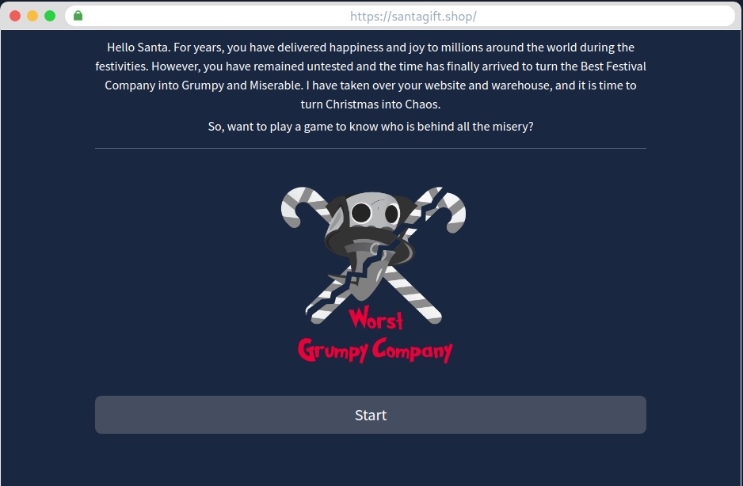
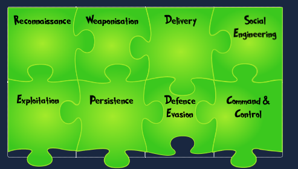
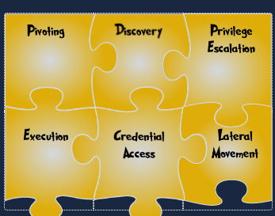
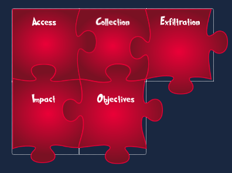

# The Story
Someone is trying to stop Christmas this year and stop Santa from delivering gifts to children who were nice this year. The Best Festival Company’s website has been defaced, and children worldwide cannot send in their gift requests. There’s much work to be done to investigate the attack and test other systems! The attackers have left a puzzle for the Elves to solve and learn who their adversaries are. McSkidy looked at the puzzle and recognised some of the pieces as the phases of the Unified Kill Chain, a security framework used to understand attackers. She has reached out to you to assist them in recovering their website, identifying their attacker, and helping save Christmas.

Let's click on view site to view the site that is defaced. 

We can see there is a puzzle which we need to solve so let's start:

## Puzzle 1:
1. Research is part of my ask, finding clues in public sources: Reconnaissance
2. Simple documents I turn into malware: Weaponisation
3. A pizza, parcel or payload all have me as an action in common: Delivery
4. A con is the name of my game, tricking you into believing a false identity: Social Engineering
5. Weaknesses are my go-to resources; through them, I make my presence felt: Exploitation
6. I am set up to let you back into the network after you leave: Persistence
7. Deletion of evidence is part of my process: Defence Evasion
8. Communication with the compromised goes through me: Command and Control 

## Puzzle 2:
1. I am an anchor that lets you go on an adventure and explore: Pivoting
2. With me, you can locate new information to expand the attack: Discovery
3. Once a pawn, I became a King: Privilege Escalation
4. My payloads are triggered to infect all they come in contact with: Execution
5. Passwords I collect are the keys to the mainframe: Credential Access
6. Side to side, machine to machine, we hop: Lateral Movement 

## Puzzle 3:
1. In your vault, I am in: Access
2. Like a dragon, I gather all valuable loot: Collection
3. I export gathered treasures: Exfiltration
4. With me, your reputation goes tumbling down: Impact
5. Goals set, goals attained. I win!: Objectives 

Wow! we got the flag and also the name of culprit.
